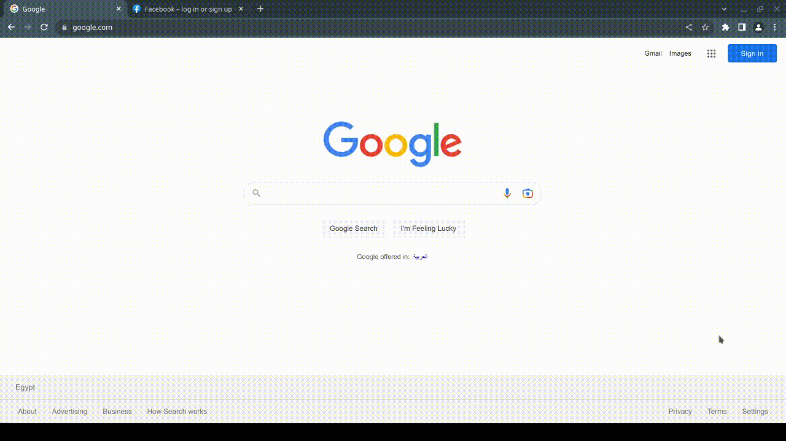
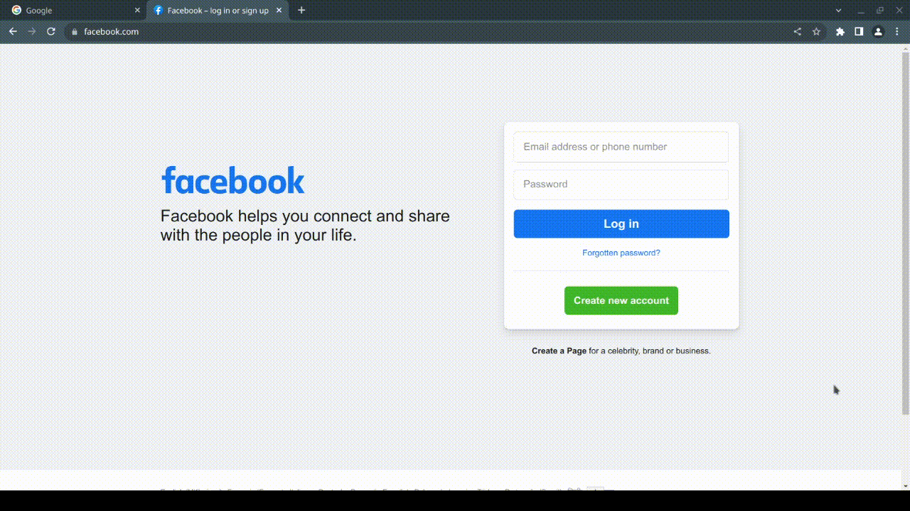
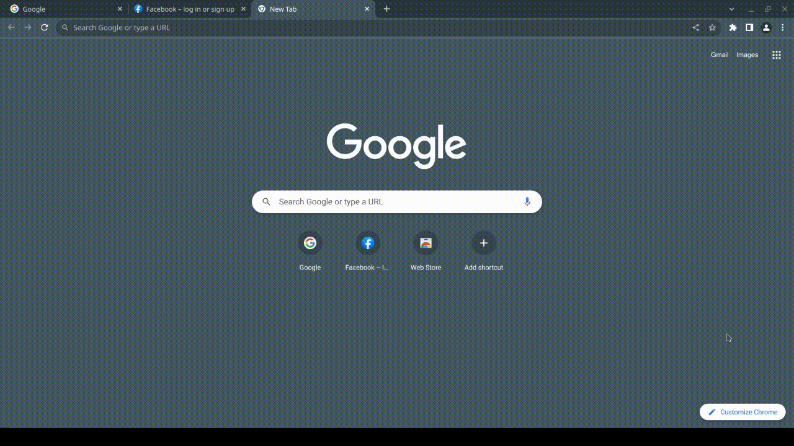

# Link Save chrome extension

## Description
A chrome extension that allows users to save links by inputting them into an input text field. The extension also includes the ability to save the current active tab and remove all saved links. This extension can be used as a simple and convenient way for users to save and organize relevant web links.

[(return to top)](#link-save-chrome-extension)

## How to use

### Add custom links
Type the link in the input field and click `SAVE INPUT`

### Add current tab
To add the active tab, click on `SAVE TAB`

### Remove saved links
To remove all links, double click on `DELETE ALL`

[(return to top)](#link-save-chrome-extension)
