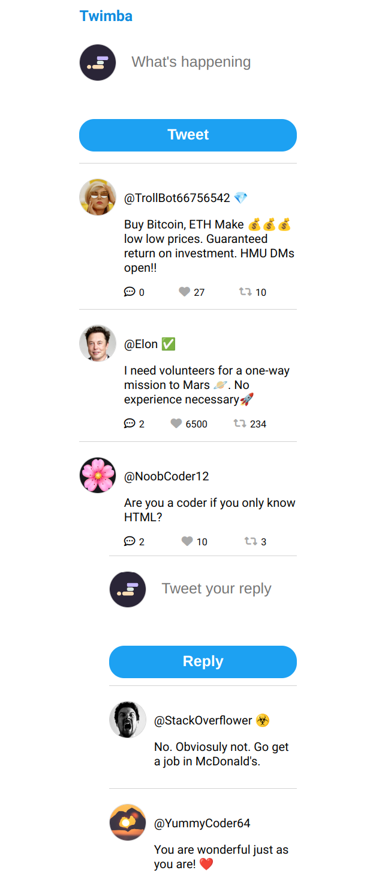

# Twimba
## Description
a Twitter-like website that has been built using HTML, CSS and JavaScript. The website features a dynamically updating feed and replies section, in addition to the ability to add new tweets and replies.

Furthermore, the website also includes interactive like and retweet buttons, which allow users to interact with them and affect the details of the tweets.

## Showcase
